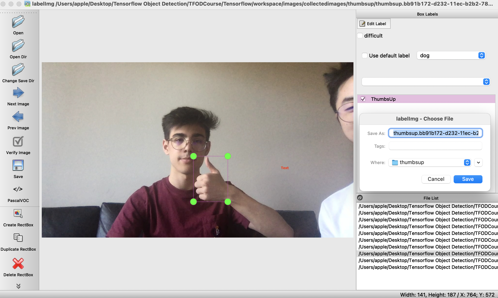
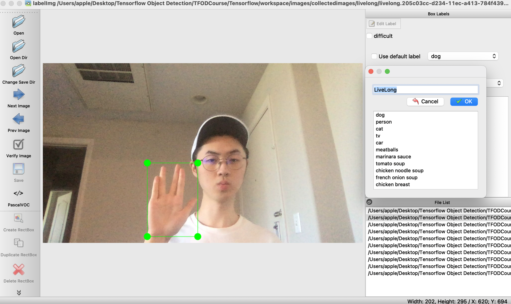
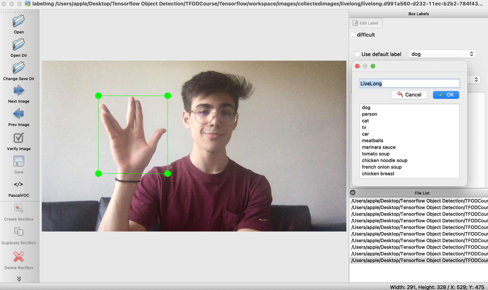
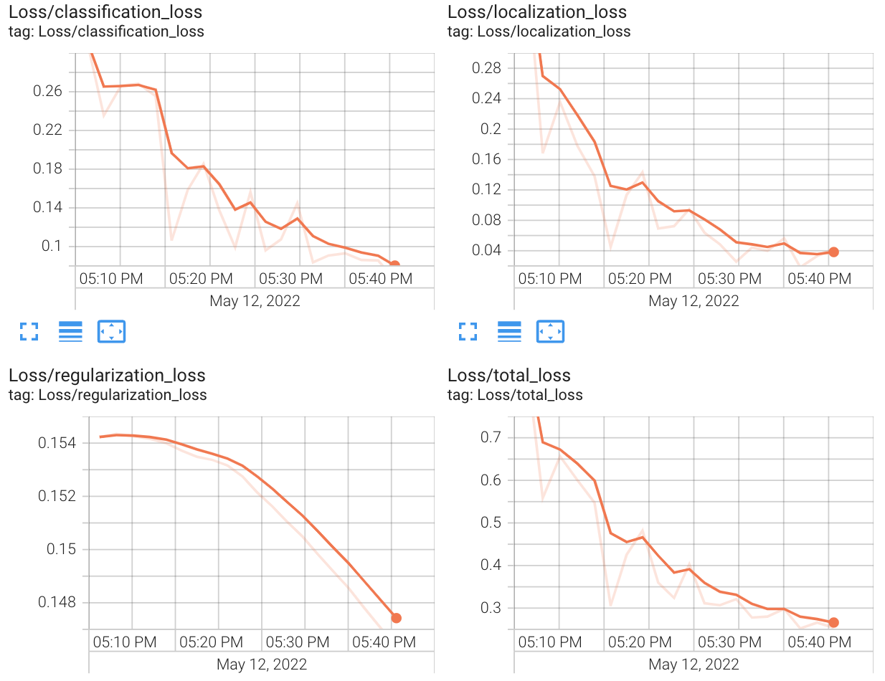
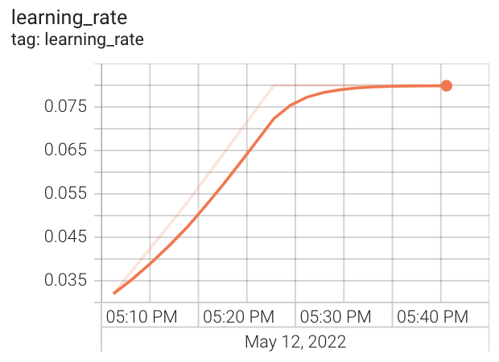
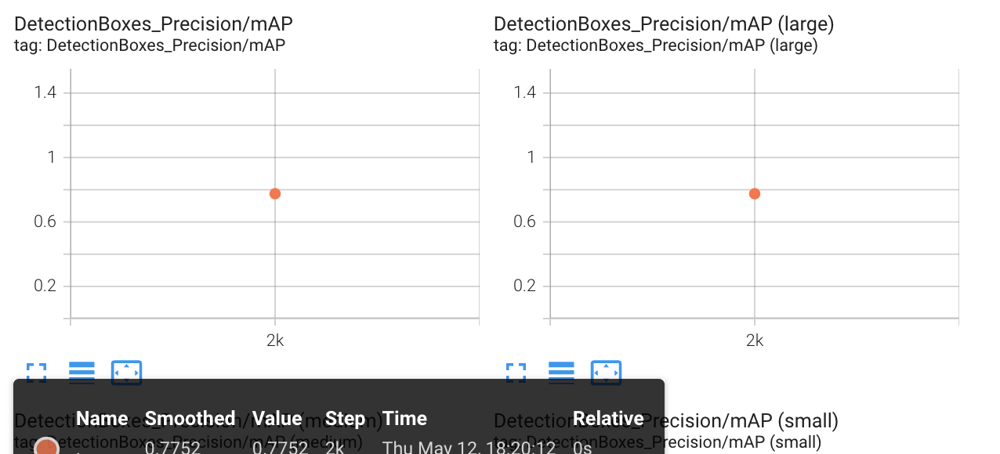
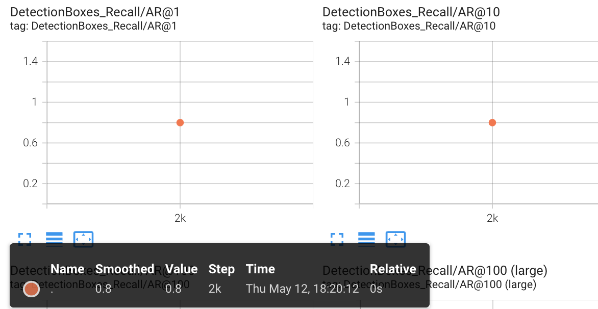
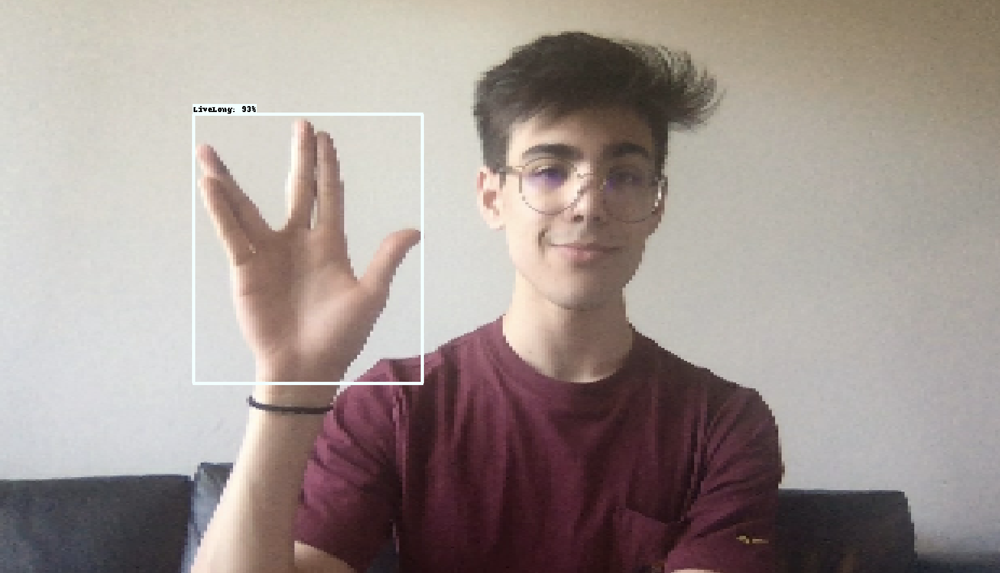
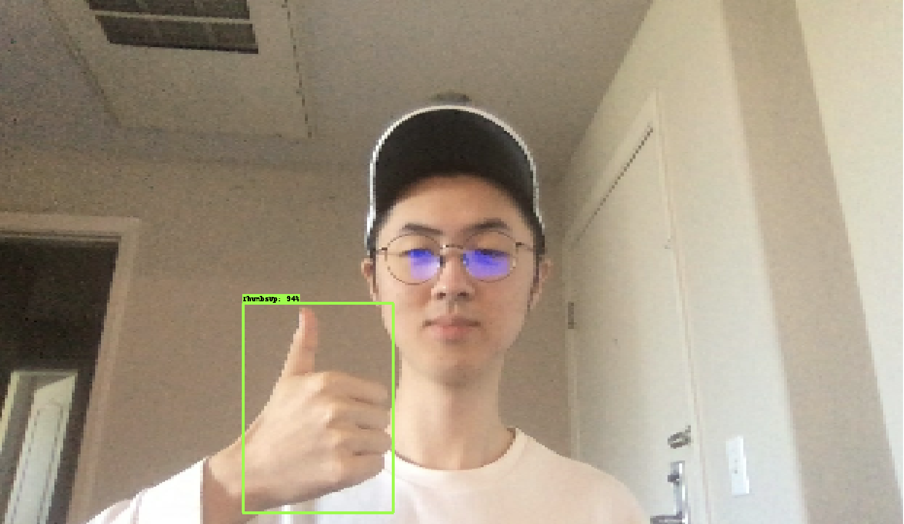
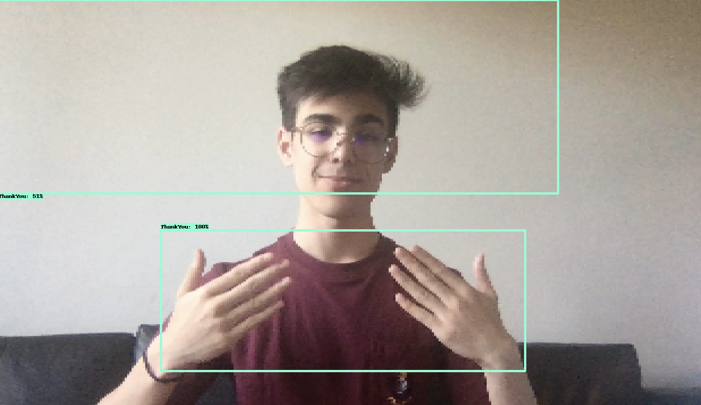

# Tensorflow Object Detection on Hand Gestures (Periodically Updating)
## Steps
 
<b>Step 1.</b> Clone this repository: https://github.com/Jerry-Li-Chao/TensorFlow_Object_Detection_Hand_Gestures
  
<b>Step 2.</b> Create a new virtual environment 
<pre>
python -m venv tfod
</pre> 
 
<b>Step 3.</b> Activate your virtual environment
<pre>
source tfod/bin/activate # Linux
.\tfod\Scripts\activate # Windows 
</pre>
 
<b>Step 4.</b> Install dependencies and add virtual environment to the Python Kernel
<pre>
python -m pip install --upgrade pip
pip install ipykernel
python -m ipykernel install --user --name=tfod
</pre>
 
<b>Step 5.</b> Collect images using the Notebook 1. Image Collection.ipynb - ensure you change the kernel to the virtual environment as shown below
 
 
<b>Step 5.1</b> Labeling pictures, create bounding boxes for features that needs to be identified.  
 
 
 
 
<b>Step 6.</b> Manually divide collected images into two folders train and test. So now all folders and annotations should be split between the following two folders.  
\Tensorflow\workspace\images\train 
\Tensorflow\workspace\images\test
  
<b>Step 7.</b> Begin training process by opening 2. Training and Detection.ipynb, this notebook will walk you through installing Tensorflow Object Detection, making detections, saving and exporting your model. 
  
<b>Step 8.</b> After installing Tensorflow Object Detection, I began my initial learning with 2000 steps. Here are the results:    
Loss Matrices:  
  
Learning Rate:  
  
Precision: 77.52%  
  
Recall: 80%  
  
  

<b>Good results:</b>  
The recognition performance for "LiveLong", "ThumbsUp", and "ThumbsDown" behave quite consistently well for a training of merely 2000 steps.  
  
  

<b>Problematic results:</b>   
The recognition performance for "ThankYou" in sign language is more prone to errors. My explanation for this is that "ThankYou" gesture is special in a way that it requires two hands, the bounding box is much bigger and thus more susceptible to the noise and variation of the input images. I will increase the training steps to 10,000 for the next training, and double the testing input image for better recognition.  
  
   
